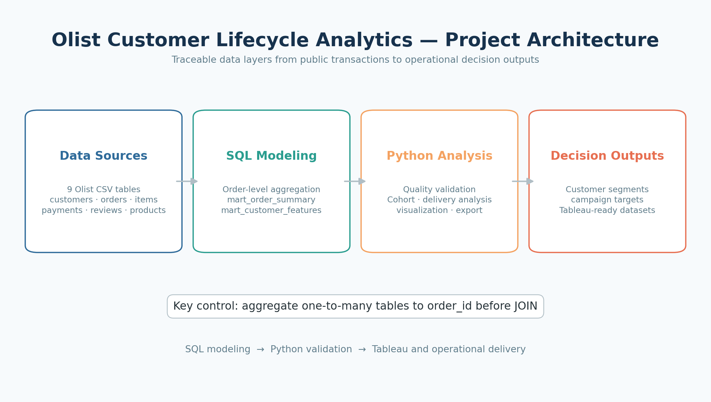
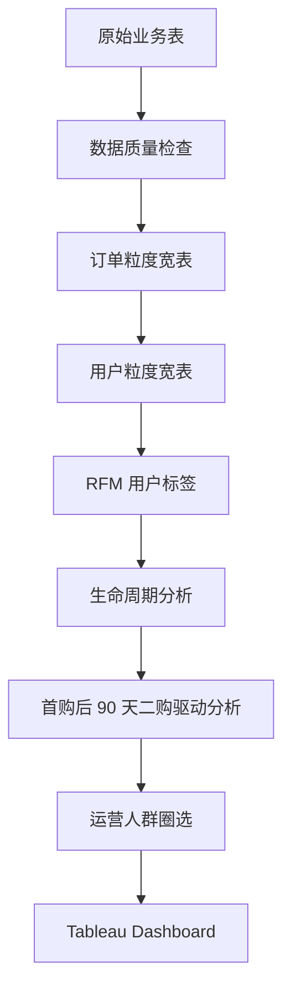
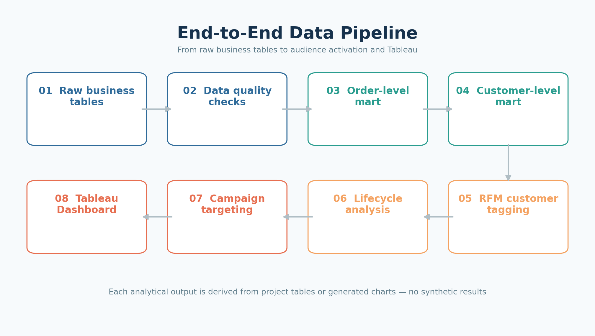
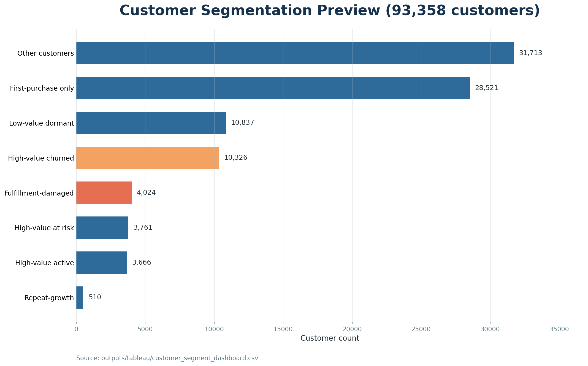
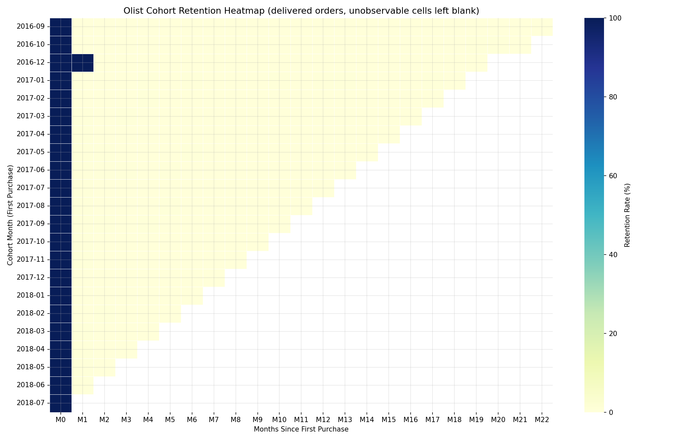
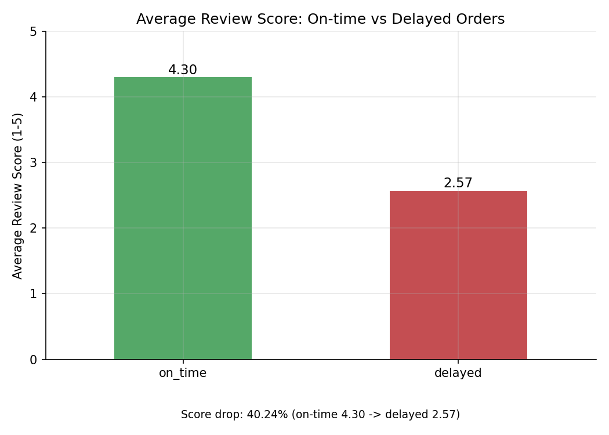
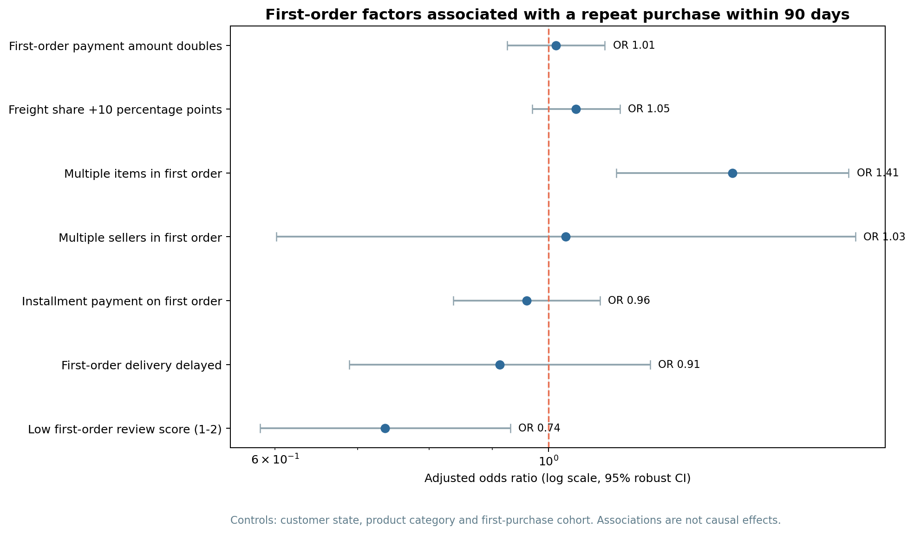
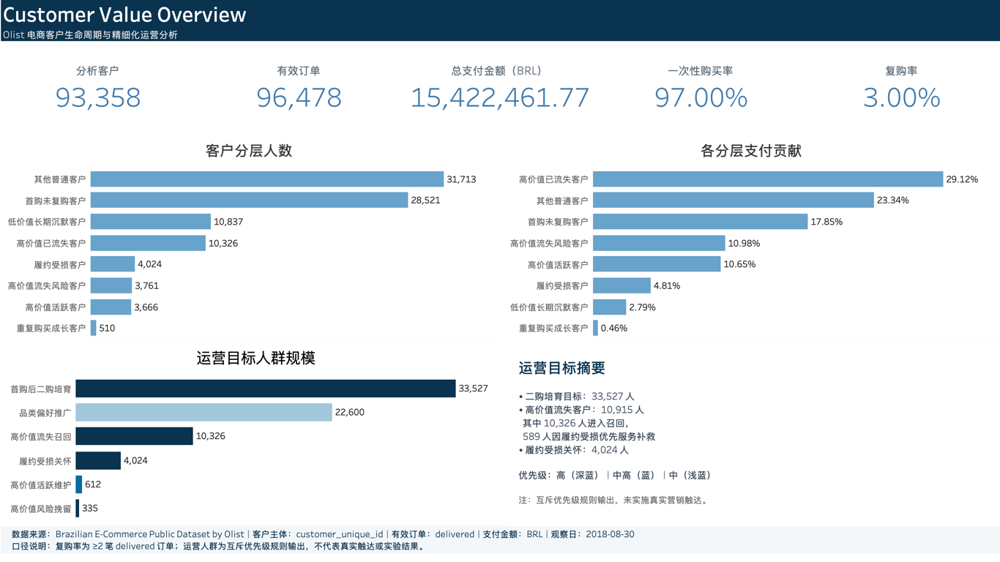
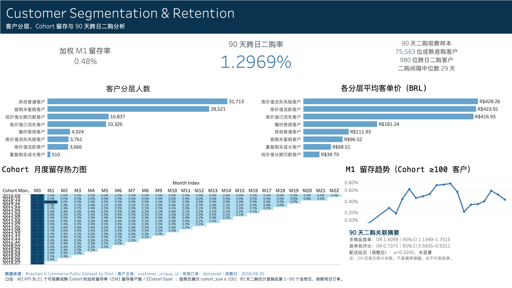
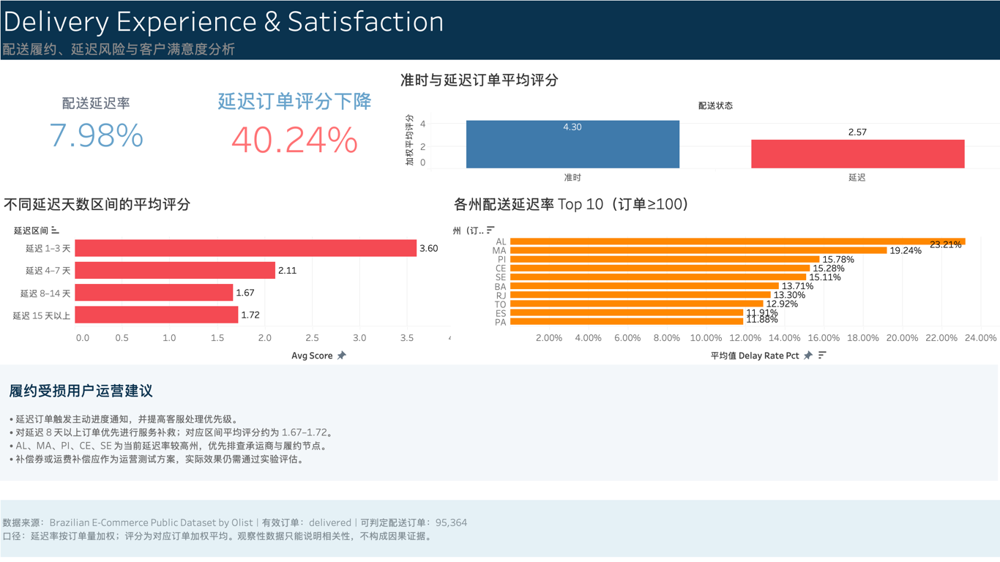

# Olist 电商客户生命周期与精细化运营分析

> 基于 Olist 巴西电商公开数据完成的端到端数据分析项目：从多表建模、用户生命周期与 RFM 标签，到运营人群圈选和 Tableau 看板数据输出。

快速审阅：[展示 Notebook](notebooks/01_project_showcase.ipynb) · [完整报告](docs/project_report.md) · [输出目录与公开边界](outputs/README.md)



## 1. 项目简介

本项目使用 **Brazilian E-Commerce Public Dataset by Olist**，围绕订单、客户、商品、支付、评价、卖家与配送等多表交易数据，构建订单粒度和用户粒度分析宽表。在此基础上完成用户生命周期分析、RFM 用户标签、精细化运营人群圈选，并为 Tableau Dashboard 提供可直接连接的数据文件。

项目的核心目标不是只描述历史经营结果，而是把分析结论转化为可执行的用户名单和运营策略，支持高价值用户维护、流失召回、首购转化与履约关怀。

## 2. 项目背景与业务问题

Olist 的交易链路同时涉及客户、订单、商品、卖家、支付、评价与配送。若只在单表层面统计，很难回答客户价值、留存与履约体验之间的关系。本项目聚焦以下业务问题：

1. **为什么用户复购低？** 分析一次性购买结构、首购后 Cohort 留存与 90 天跨日二购的首单关联因素。
2. **哪些客户最有价值？** 使用 RFM、消费金额与生命周期识别高价值人群。
3. **哪些客户存在流失风险？** 根据最近购买时间和活跃状态识别流失风险及已流失客户。
4. **配送体验是否影响满意度？** 对比准时与延迟订单的评价表现，并明确相关性边界。
5. **如何输出运营目标用户？** 将价值、生命周期、行为和履约体验标签转化为可执行的营销名单。

## 3. 数据来源

- 数据集：[Brazilian E-Commerce Public Dataset by Olist](https://www.kaggle.com/datasets/olistbr/brazilian-ecommerce)
- 原始数据放置说明：[data/README.md](data/README.md)
- 分析客户主键使用 `customer_unique_id`；`customer_id` 为订单级客户标识，不用于跨订单复购识别。

项目使用以下业务表：

| 数据表 | 主要用途 |
| --- | --- |
| `customers` | 客户标识与地区 |
| `orders` | 订单状态与履约时间 |
| `order_items` | 商品、卖家、价格与运费 |
| `payments` | 支付方式、分期与支付金额 |
| `reviews` | 订单评分与评价信息 |
| `products` | 商品属性与品类 |
| `sellers` | 卖家信息与地区 |
| `geolocation` | 邮编与地理位置 |
| `category translation` | 葡萄牙语品类英文映射 |

数据包含 9 张原始表、99,441 笔原始订单和 96,096 名全量真实客户；其中 96,478 笔已交付订单进入有效订单分析。字段与口径详见 [数据字典](docs/data_dictionary.md) 和 [指标定义](docs/metric_definitions.md)。

## 4. 技术栈

| 模块 | 技术与应用 |
| --- | --- |
| SQL | MySQL、多表 JOIN、CTE、窗口函数、分层聚合 |
| Python | pandas、numpy、matplotlib、seaborn、statsmodels |
| BI | Tableau |
| 工程化 | 配置管理、模块化流水线、数据质量检查、pytest、SQL × Python 交叉验证 |

## 5. 数据处理流程





SQL 负责原始表聚合、宽表建模、用户分层、Cohort 与营销名单计算；Python 负责结果校验、统计分析、图表与 Tableau 数据导出。核心指标已通过 SQL 与 Python 双重校验，验证结果见 [`outputs/tables/cross_validation_results.csv`](outputs/tables/cross_validation_results.csv)。

## 6. 数据建模

### 订单宽表：`mart_order_summary`

将订单、商品、支付、评价和配送信息整合为一单一行，提供订单金额、商品数量、支付、评价与是否延迟等字段。

### 用户宽表：`mart_customer_features`

以 `customer_unique_id` 为粒度汇总已交付订单，形成购买频次、消费金额、客单价、最近购买时间、品类偏好、评分与延迟率等客户特征。

### 为什么先聚合再 JOIN

`order_items`、`order_payments` 与 `order_reviews` 对订单均可能是一对多关系。若直接多表 JOIN，同一订单的商品行、支付行和评价行会发生笛卡尔式放大，导致订单金额和商品数量重复计算。因此项目先分别聚合到 `order_id`，再构建 `mart_order_summary`，最后生成用户粒度宽表。

## 7. 用户标签体系

### RFM 标签

| 维度 | 含义 | 项目应用 |
| --- | --- | --- |
| R — Recency | 最近购买时间 | 判断客户当前活跃程度与流失风险 |
| F — Frequency | 购买频次 | 区分一次性购买与复购客户 |
| M — Monetary | 消费金额 | 识别高、中、低价值客户 |

### 生命周期标签

- 新用户
- 活跃用户
- 流失风险用户
- 已流失用户

### 运营标签

- 高价值客户
- 高价值流失客户
- 首购未复购客户
- 履约受损客户

完整标签规则、阈值与互斥优先级见 [指标定义](docs/metric_definitions.md)。



> 口径说明：图中的“高价值已流失客户”是互斥最终分层中的 10,326 人；完整的高价值且已流失人群为 10,915 人，其中 589 人因更高优先级被归入“履约受损客户”。

## 8. 核心发现

以下数字均原样取自 [`docs/resume_metrics.md`](docs/resume_metrics.md)，未进行外推：

| 分析主题 | 核心发现 | 业务含义 |
| --- | --- | --- |
| 复购结构 | 一次性购买用户占比 **97.00%**，复购用户占比 **3.00%** | 增长重点应从单纯获客延伸到首购后的二购转化 |
| 首购留存 | 21 个成熟 Cohort 的**加权 M1 留存率为 0.48%**（390 / 81,265） | 首购后次月留存偏低，需要建立首购培育机制 |
| 高价值流失 | 识别 **10,915** 名高价值流失用户 | 该人群具有明确的召回与关怀优先级 |
| 收入贡献 | 高价值流失用户历史支付金额占比 **30.89%** | 少量关键人群承载较高的历史收入贡献 |
| 履约体验 | 延迟订单平均评分 **2.57**，准时订单 **4.30**，延迟订单评分下降 **40.24%** | 配送异常用户应进入优先服务补救与满意度修复流程 |
| 90 天二购 | 75,563 名成熟首购客户中 **980** 人发生跨日二购，二购率 **1.2969%** | 需要在首购后尽早建立二购培育机制，并排除同日拆单对复购口径的干扰 |





### 首购后 90 天二购驱动因素

为避免把同日拆单或同次购物会话误判为复购，本专题将“二购”定义为首购后第 1–90 个自然日出现下一笔 `delivered` 订单，并只保留拥有完整 90 天观察窗的客户。购买时模型覆盖 75,563 人；加入首单配送与评分体验的完整样本模型覆盖 74,820 人，均控制客户州、主品类与首购月份。

| 首单特征 | 实际二购率对比 | 调整后结果（完整体验样本） | 结论 |
| --- | --- | --- | --- |
| 多商品 vs 单商品 | 1.7897% vs 1.2423% | OR=1.4099，95% CI 1.1349–1.7515，p=0.0019 | 与 90 天二购呈显著正向关联 |
| 低评分（1–2 分） | 0.9885% | OR=0.7371，95% CI 0.5835–0.9311，p=0.0105 | 与 90 天二购呈显著负向关联 |
| 延迟 vs 按时 | 1.0588% vs 1.3198% | OR=0.9127，95% CI 0.6890–1.2090，p=0.5242 | 描述性差异存在，调整后未发现显著关联 |



完整口径、模型结果和限制见 [90 天二购分析报告](docs/repeat_purchase_90d_analysis.md)；可审阅工作簿见 [90 天二购分析工作簿](outputs/tables/repeat_purchase_90d_analysis.xlsx)。赔率比只表示调整后的统计关联，不等同于因果效应或概率提升幅度。

## 9. Tableau Dashboard

Tableau 最终打包工作簿为 [`Olist_Customer_Lifecycle_Dashboard.twbx`](outputs/tableau/Olist_Customer_Lifecycle_Dashboard.twbx)，使用的汇总数据位于 [`outputs/tableau/`](outputs/tableau/)。三页 Dashboard 覆盖客户价值总览、用户分层与留存、履约体验和运营目标人群。

> 以下三张图片均为最终 TWBX 对应的 Tableau 原生导出截图。M1 KPI 使用 21 个可观察成熟 Cohort 的加权口径（ΣM1 留存客户数 / ΣCohort Size）= 0.48%；M1 趋势仅展示 `cohort_size ≥ 100`。







## 10. 运营策略

| 运营场景 | 目标人群 | 建议动作 |
| --- | --- | --- |
| 高价值用户维护 | 高价值新客与活跃客户 | 提供会员权益、专属服务、新品优先与推荐激励 |
| 流失用户召回 | 高价值流失及流失风险客户 | 按历史价值与偏好设计分层召回，优先覆盖高贡献客户 |
| 首购用户二购激励 | 首购未复购客户 | 在首购后设置二购优惠、关联品类推荐与分阶段提醒 |
| 履约问题用户关怀 | 延迟且低评分客户 | 提供主动解释、售后关怀、补偿与满意度回访 |

项目仅输出运营目标名单、推荐动作与 A/B 测试方案，不包含任何真实触达或实验结果。实验设计见 [A/B 测试方案](docs/ab_test_design.md)。

## 11. 项目运行方式

### 环境安装

```bash
python -m venv .venv
source .venv/bin/activate
pip install -r requirements.txt
```

### 数据准备

将 Olist 原始 CSV 放入 `data/raw/`，并按 [`data/README.md`](data/README.md) 配置文件名。数据库连接使用 `config/config.yaml` 或环境变量，真实凭据不应提交到 GitHub。

### 运行流程

```bash
# 查看配置与数据是否就绪
python run_pipeline.py --check-config

# 查看全部可运行阶段
python run_pipeline.py --list-stages

# 按依赖顺序运行建模与分析阶段
python run_pipeline.py --stage build_order_mart
python run_pipeline.py --stage build_customer_mart
python run_pipeline.py --stage segmentation
python run_pipeline.py --stage cohort
python run_pipeline.py --stage delivery
python run_pipeline.py --stage repeat_purchase_90d
python run_pipeline.py --stage campaign
python run_pipeline.py --stage export

# 入口不带参数时会打印阶段说明
python run_pipeline.py
```

完整导入、建库、验证和测试命令见流水线源码 [`run_pipeline.py`](run_pipeline.py)。

### 展示 Notebook（无需数据库）

[`notebooks/01_project_showcase.ipynb`](notebooks/01_project_showcase.ipynb) 串联数据模型、客户分层、Cohort 留存、90 天跨日二购、履约体验与运营建议，保留真实执行输出。只读取仓库中已有的 9 份公开汇总 CSV，不读取客户级名单，不重新执行生产流程或拟合模型。

```bash
# 已安装 requirements.txt 后，可在 Jupyter 中从头运行全部单元格
jupyter notebook notebooks/01_project_showcase.ipynb

# 无界面复现；将已执行副本保存到本地生成产物目录
jupyter nbconvert --to notebook --execute notebooks/01_project_showcase.ipynb \
  --output-dir outputs/local/notebook_runs --ExecutePreprocessor.timeout=180
```

Notebook 重新核算加权 M1 留存率 0.48%，并检查源文件哈希不变。所有单元格均不写入分析源文件，也不需要真实数据库配置。

### 文件夹分工

| 目录 | 主要内容 | GitHub 发布范围 |
| --- | --- | --- |
| `sql/`、`src/` | 建模 SQL、生产分析与导出代码 | 发布 |
| `notebooks/` | 精简、已执行的展示 Notebook | 发布 |
| `docs/` | 指标、报告、建模说明与项目简历素材 | 发布项目源文档；忽略完整个人简历及本地 HTML/PDF 报告副本 |
| `outputs/tables/` | Cohort、二购、履约与校验汇总 | 精确白名单 |
| `outputs/figures/`、`outputs/tableau/` | 正式分析图、最终 Tableau 数据、TWBX 与原生截图 | 精确白名单 |
| `outputs/local/` | 客户级名单、模拟任务、中间 CSV、诊断与本地预览 | 整个目录不发布 |
| `tools/legacy/` | 历史布局原型工具，仅供本地保留 | 整个目录不发布 |
| `data/`、`logs/`、`config/` | 本地输入、审计明细、日志和配置 | 仅发布数据说明、占位文件和配置示例 |
| `tests/`、`.github/` | 自动化测试与 CI | 发布 |

客户级只描述数据粒度，不等于敏感或不可公开。本项目使用公开匿名化数据，完整客户名单与中间产物集中到 `outputs/local/`，不纳入 Git 是为了减少重复数据和仓库体积。公开展示 [6 条真实运营样例及字段说明](docs/customer_samples.md)，按每类规则一条确定性选取，不代表随机样本或实际触达。目录与生成方式见 [输出目录说明](outputs/README.md)。旧设计预览工具保留在本地 `tools/legacy/build_tableau_previews.py`，不上传 GitHub，也不覆盖最终 Tableau 原生截图。

## 12. 项目限制

- 数据为历史公开数据，不能代表 Olist 当前经营状态。
- 数据集中没有真实营销触达记录，运营实验仅为 A/B 测试方案设计，不报告实验结果。
- 客户流失与留存受历史观察窗口限制，观察窗口之后的行为不可见。
- 配送延迟与评分之间的关系来自观察性数据；相关性不代表因果。
- 90 天二购模型基于观察性首单特征；赔率比是条件关联，需通过随机实验验证运营动作的增量效果。
- 数据缺少商品成本、营销成本以及浏览、点击和广告曝光行为，无法完整衡量利润、真实 CLV 或触达归因。

## 13. 许可证与数据使用

本项目自行编写的 Python、SQL、测试、配置与工作流，以及 Notebook 中的代码单元，采用 [MIT License](LICENSE)。使用、修改或分发这些代码时，请保留版权与许可声明。

MIT 不覆盖 Olist 原始数据及其改编结果，包括公开汇总表、真实客户样例、数据图表、Tableau 中的内嵌数据和 Notebook 的数据输出。这些内容遵循原数据集的 [CC BY-NC-SA 4.0](https://creativecommons.org/licenses/by-nc-sa/4.0/) 要求（署名、非商业、相同方式共享）；不能因代码采用 MIT 而将数据用于商业用途。数据来源、改编方式和下载说明见 [数据说明](data/README.md) 与 [真实样例说明](docs/customer_samples.md)。第三方依赖保留各自许可证。

---

本项目的指标、图表和名单均来自实际数据处理结果；核心数字索引见 [`docs/resume_metrics.md`](docs/resume_metrics.md)，完整分析报告见 [`docs/project_report.md`](docs/project_report.md)。
