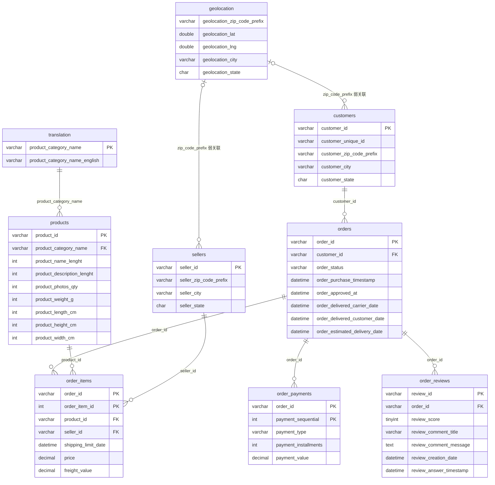

# ER 图（实体关系图）

> Olist 数据集共 9 张表，核心事实表为 `orders`，围绕订单关联客户、商品明细、支付与评价四个维度。

## 简化 ER 图

## 关系说明

| 关系 | 基数 | 说明 |
| --- | --- | --- |
| customers → orders | 1 : N | `customer_id` 为订单级标识；同一 `customer_unique_id` 可有多笔订单 |
| orders → order_items | 1 : N | 一笔订单可含多个商品行 |
| orders → order_payments | 1 : N | 一笔订单可有多条支付记录（组合支付） |
| orders → order_reviews | 1 : N | 一笔订单可能对应多条评价；原始文件另有重复 `review_id`，导入时按既定规则处理 |
| products → order_items | 1 : N | 同一商品可出现在多个订单 |
| sellers → order_items | 1 : N | 同一卖家可履约多个订单 |
| translation → products | 1 : N | 类别葡萄牙语 → 英文名 |
| geolocation ↔ customers / sellers | N : N（弱） | 仅通过邮编前缀关联，且邮编存在重复坐标，不进入核心建模 |

## 建模关键提示

1. `order_items`、`order_payments`、`order_reviews` 相对 `orders` 均为一对多，
   构建订单宽表时必须**先分别聚合到 `order_id` 粒度**再连接，否则产生多对多行数膨胀。
2. 复购与留存分析的主体是 `customer_unique_id`，而不是 `customer_id`。
3. `geolocation` 表不参与核心宽表构建（客户/卖家表已含城市与州字段）。
